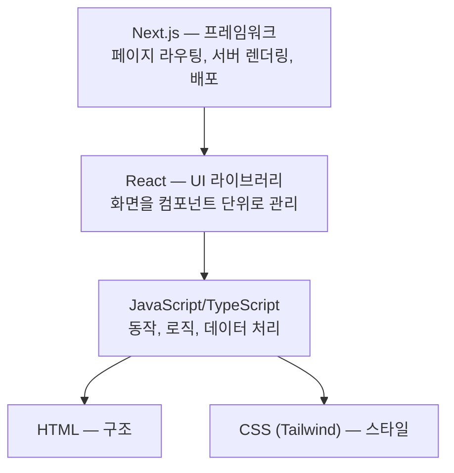
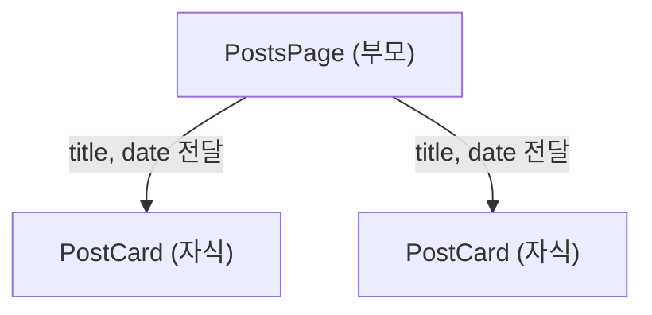
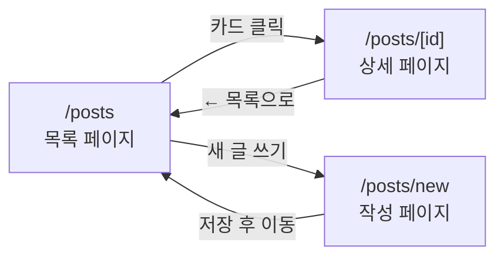
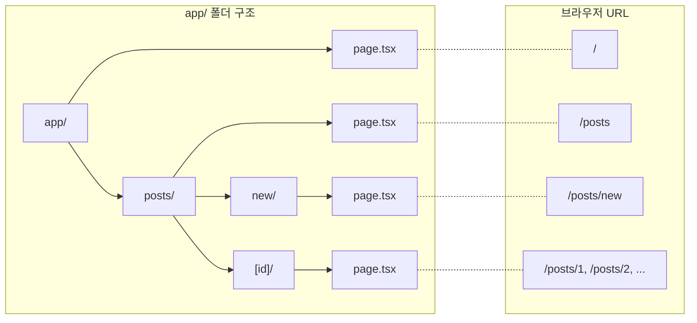
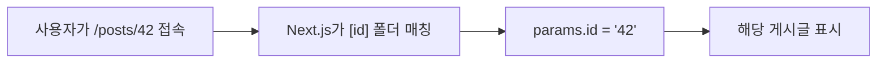

# Chapter 5. Next.js 라우팅 — 여러 페이지 만들기

> **미션**: 블로그에 목록·상세·작성 3개 페이지를 구현하고 배포한다
> 

---

## 학습목표

1. Next.js App Router의 파일 기반 라우팅 구조를 설명할 수 있다
2. 동적 라우트(`[id]`)와 `await params` 패턴을 이해할 수 있다
3. Link 컴포넌트와 useRouter의 차이를 구분할 수 있다
4. AI가 생성한 라우팅 코드에서 흔한 실수를 발견할 수 있다

---

## 🤖 출발점 맞추기: ask가 아니라 agent로 되어 있는지 항상 체크

Ch3~Ch4를 거치며 각자 다른 화면을 가지고 있다. Ch5부터는 **동일한 출발점**에서 시작해야 같은 코드로 실습할 수 있다.

Copilot Chat(Agent 모드)에 아래 프롬프트를 입력한다:

터미널 - 새터미널 - npm run dev
`http://localhost:3000` 클릭

> "현재 my-first-web 폴더에 app 폴더가 구성되어 있다. 이 프로젝트를 아래의 조건으로 변경해줘: 기존의 파일들을 교체해야한다.
> 
> 1. app/page.tsx — 블로그 메인 페이지. '내 블로그'라는 제목과 간단한 소개 문구만 표시. Tailwind CSS 스타일링.
> 2. app/layout.tsx — 기본 레이아웃. html lang='ko', body 안에 nav(bg-gray-800, 흰색 텍스트, '내 블로그' 텍스트만), main(max-w-4xl mx-auto p-6으로 {children} 감싸기), footer(© 2026 내 블로그, 가운데 정렬, 회색). 아직 Link 컴포넌트 사용하지 말고 일반 텍스트로.
> 3. app/globals.css — @import 'tailwindcss' 한 줄만. 다른 스타일 모두 삭제.
> 4. 기존에 다른 페이지 폴더(about, contact 등)가 있으면 삭제하지 말고 그대로 둬.
> 
> Next.js 16 App Router, Tailwind CSS 4, TypeScript."
> 

### 확인

- [ ]  `http://localhost:3000`에 접속하면 내비게이션 바 + "내 블로그" 메인 + 푸터가 보이는가?
- [ ]  아래와 비슷한 화면인가?

```
┌─────────────────────────────────┐
│ ██ 내 블로그 ██                   │  ← nav
├─────────────────────────────────┤
│                                 │
│  내 블로그                        │
│  웹 개발을 배우며 기록하는 공간        │
│                                 │
├─────────────────────────────────┤
│      © 2026 내 블로그             │  ← footer
└─────────────────────────────────┘
```

> 화면이 다르더라도 **nav-main-footer 3단 구조**가 보이면 OK. 이후 실습에서 점차 채워나간다.
> 

---

## 0. React와 Next.js 기초

### 먼저 큰 그림 보기

Ch3에서 HTML/CSS로 화면의 구조와 모양을 만들었고, Ch4에서 JavaScript로 동작을 배웠다. 이번 장부터는 **React와 Next.js 위에서** 실제 여러 페이지를 가진 앱을 만든다.



### 컴포넌트란

React의 핵심 아이디어: **함수가 화면을 돌려주면 컴포넌트**이다.

```tsx
function PostCard() {
  return (
    <div className="p-4 border rounded-lg">
      <h2 className="text-lg font-bold">게시글 제목</h2>
      <p className="text-gray-600">게시글 내용...</p>
    </div>
  );
}
```

> **렌더링 결과**:
> 
> 
> ```
> ┌─────────────────────────┐
> │ 게시글 제목              │
> │ 게시글 내용...           │
> └─────────────────────────┘
> ```
> 

레고 블록처럼 작은 컴포넌트를 조립하여 화면을 구성한다.

### Props — 부모가 자식에게 데이터 전달

**Props**는 컴포넌트에 데이터를 넘겨주는 방법이다. 함수의 매개변수와 같다.

```tsx
// PostsPage — 부모 컴포넌트 (카드 여러 개를 조립한다)
function PostsPage() {
  return (
    <div>
      <h1 className="text-2xl font-bold mb-4">블로그</h1>
      <PostCard title="첫 번째 글" date="2026-03-01" />
      <PostCard title="두 번째 글" date="2026-03-05" />
    </div>
  );
}

// PostCard — 자식 컴포넌트 (카드 1개를 그린다)
function PostCard({ title, date }: { title: string; date: string }) {
  return (
    <div className="p-4 border rounded-lg">
      <h2 className="font-bold">{title}</h2>
      <p className="text-sm text-gray-500">{date}</p>
    </div>
  );
}
```

> **렌더링 결과**:
> 
> 
> ```
> ┌─────────────────────────┐
> │ 블로그                   │
> │                         │
> │ ┌─────────────────────┐ │
> │ │ 첫 번째 글           │ │
> │ │ 2026-03-01          │ │
> │ └─────────────────────┘ │
> │ ┌─────────────────────┐ │
> │ │ 두 번째 글           │ │
> │ │ 2026-03-05          │ │
> │ └─────────────────────┘ │
> └─────────────────────────┘
> ```
> 

`{ title: string; date: string }` 부분은 TypeScript 타입 표기이다. AI가 자동으로 생성해주므로, "이 컴포넌트가 어떤 데이터를 받는지 명시한 것"으로 이해하면 충분하다.

부모(`PostsPage`)가 자식(`PostCard`)에게 데이터를 넘겨주는 구조:



---

## 실습 전 준비

- [ ]  프로젝트 폴더가 VS Code에서 열려 있는가?
- [ ]  터미널에서 `npm run dev`를 실행했는가?
- [ ]  브라우저에서 `http://localhost:3000`이 열리는가?
- [ ]  위 "출발점 맞추기"를 완료했는가?

---

## 이번 실습의 완성 목표

3개 페이지를 만들고 내비게이션으로 연결한다:

```
┌─────────────────────────────────────────┐
│ ██ 내 블로그 | 홈 | 블로그 | 새 글 ██   │
├─────────────────────────────────────────┤
│                                         │
│  /posts (목록)     /posts/1 (상세)       │
│  ┌────────┐        ┌────────────────┐   │
│  │ 글 1   │───────>│ React 19 정리  │   │
│  │ 글 2   │        │ 김코딩 · 03-30 │   │
│  │ 글 3   │<───────│ ← 목록으로     │   │
│  └────────┘        └────────────────┘   │
│       │                                 │
│       v                                 │
│  /posts/new (작성)                       │
│  ┌────────────────┐                     │
│  │ 제목: [      ] │                     │
│  │ 내용: [      ] │                     │
│  │ [저장] ────────────> /posts로 이동    │
│  └────────────────┘                     │
└─────────────────────────────────────────┘
```



---

## 5.1 App Router — 폴더가 곧 URL

Next.js App Router의 핵심 규칙: **폴더를 만들면 URL이 된다.**

### 파일 경로 → URL 매핑

| 파일 경로 | URL |
| --- | --- |
| `app/page.tsx` | `/` |
| `app/about/page.tsx` | `/about` |
| `app/posts/page.tsx` | `/posts` |
| `app/posts/new/page.tsx` | `/posts/new` |
| `app/posts/[id]/page.tsx` | `/posts/1`, `/posts/2`, ... |



규칙 3줄:

1. `app/` 안에 **폴더**를 만든다 = URL 경로가 생긴다
2. 그 폴더 안에 **`page.tsx`*를 만든다 = 해당 URL의 페이지가 된다
3. `page.tsx`가 없는 폴더는 URL을 만들지 않는다

### page.tsx — 페이지 정의

`page.tsx`는 해당 URL에서 보여줄 내용을 정의한다. React 컴포넌트를 **`export default`**로 내보내면 된다.

```tsx
// app/posts/page.tsx — /posts URL의 페이지
export default function PostsPage() {
  return (
    <div className="max-w-4xl mx-auto p-6">
      <h1 className="text-2xl font-bold mb-4">블로그</h1>
      <p>블로그 글 목록이 여기에 표시됩니다.</p>
    </div>
  );
}
```

> **렌더링 결과** — 브라우저에서 `/posts` 접속 시:
> 
> 
> ```
> ┌─────────────────────────────────┐
> │                                 │
> │  블로그                          │
> │  블로그 글 목록이 여기에 표시됩니다. │
> │                                 │
> └─────────────────────────────────┘
> ```
> 

기억할 것:

- `export default function` — 페이지 컴포넌트는 반드시 **default export**
- 함수 이름은 관례적으로 `[경로명]Page` (예: PostsPage, AboutPage)

### layout.tsx — 공통 레이아웃

`layout.tsx`는 여러 페이지에 **공통으로 적용되는 구조**(내비게이션 바, 푸터 등)를 정의한다.

```tsx
// app/layout.tsx — 모든 페이지에 적용
export default function RootLayout({ children }: { children: React.ReactNode }) {
  return (
    <html lang="ko">
      <body>
        <nav className="bg-gray-800 text-white p-4">
          내 블로그 | 홈 | 블로그
        </nav>
        <main className="max-w-4xl mx-auto p-6">
          {children}
        </main>
        <footer className="text-center text-gray-500 py-4">
          © 2026 내 블로그
        </footer>
      </body>
    </html>
  );
}
```

> **렌더링 결과** — 어떤 페이지를 열든 이 구조가 유지된다:
> 
> 
> ```
> ┌─────────────────────────────────┐
> │ ██ 내 블로그 | 홈 | 블로그 ██   │  ← nav (항상 동일)
> ├─────────────────────────────────┤
> │                                 │
> │   {children} ← 각 페이지 내용    │
> │                                 │
> ├─────────────────────────────────┤
> │      © 2026 내 블로그            │  ← footer (항상 동일)
> └─────────────────────────────────┘
> ```
> 

`{children}` 자리에 각 페이지(`page.tsx`)의 내용이 들어간다. 레이아웃이 "틀"이고, 페이지가 "내용"이다.

### 특수 파일 (참고)

| 파일 | 역할 | 비고 |
| --- | --- | --- |
| `page.tsx` | 해당 URL의 페이지 내용 | 필수 |
| `layout.tsx` | 공통 구조 (네비, 푸터) | 선택 |
| `loading.tsx` | 로딩 중 표시할 UI | Ch12에서 자세히 |
| `error.tsx` | 에러 발생 시 표시할 UI | Ch12에서 자세히 |
| `not-found.tsx` | 404 페이지 | 선택 |

### 목록 페이지 완성 코드

실제 블로그 목록 페이지를 만들면 이런 형태가 된다.

먼저 더미 데이터 파일:

```tsx
// lib/posts.ts
// type = "게시글 데이터는 이런 모양이다"라고 정의 (AI가 자동 생성)
export type Post = {
  id: number;
  title: string;
  content: string;
  author: string;
  date: string;
};

export const posts: Post[] = [
  { id: 1, title: "React 19 새 기능 정리", content: "React 19에서 달라진 점...", author: "김코딩", date: "2026-03-30" },
  { id: 2, title: "Tailwind CSS 4 변경사항", content: "Tailwind CSS 4의 핵심...", author: "이디자인", date: "2026-03-28" },
  { id: 3, title: "Next.js 16 App Router 가이드", content: "App Router를 사용하면...", author: "박개발", date: "2026-03-25" },
];
```

코드 읽기 포인트:

- `type Post = { ... }` — "게시글 데이터는 이런 모양이다"라고 정의한 **설계도**. 실제 데이터가 아니라 형태만 정한 것이다
- `Post[]` — Post 배열 = "Post 여러 개가 담긴 목록"
- `export` — 다른 파일에서 `import { posts } from "@/lib/posts"`로 가져다 쓸 수 있게 내보내기

| 개념 | 비유 |
| --- | --- |
| `type Post` | 이력서 양식 (이름, 연락처, 경력 칸) |
| `posts: Post[]` | 양식대로 작성된 이력서 3장 |

그리고 목록 페이지:

```tsx
// app/posts/page.tsx
import Link from "next/link";
import { posts } from "@/lib/posts";

export default function PostsPage() {
  return (
    <div className="max-w-4xl mx-auto p-6">
      <h1 className="text-2xl font-bold mb-6">블로그</h1>
      <div className="grid grid-cols-1 md:grid-cols-2 gap-4">
        {posts.map((post) => (
          <Link key={post.id} href={`/posts/${post.id}`}
            className="block p-4 border rounded-lg hover:shadow-lg transition">
            <h2 className="font-bold">{post.title}</h2>
            <p className="text-sm text-gray-500">{post.author} · {post.date}</p>
          </Link>
        ))}
      </div>
    </div>
  );
}
```

> **렌더링 결과** — 브라우저에서 `/posts` 접속 시:
> 
> 
> ```
> ┌─────────────────────────────────────────┐
> │ ██ 내 블로그 | 홈 | 블로그 ██           │
> ├─────────────────────────────────────────┤
> │                                         │
> │  블로그                                  │
> │                                         │
> │  ┌──────────────────┐ ┌────────────────┐│
> │  │ React 19 새 기능  │ │ Tailwind CSS 4 ││
> │  │ 정리              │ │ 변경사항        ││
> │  │ 김코딩 · 03-30    │ │ 이디자인 · 03-28││
> │  └──────────────────┘ └────────────────┘│
> │  ┌──────────────────┐                   │
> │  │ Next.js 16 App   │                   │
> │  │ Router 가이드     │                   │
> │  │ 박개발 · 03-25    │                   │
> │  └──────────────────┘                   │
> │                                         │
> ├─────────────────────────────────────────┤
> │           © 2026 내 블로그               │
> └─────────────────────────────────────────┘
> ```
> 

코드 읽기 포인트:

- `posts.map(...)` — Ch4에서 배운 배열 메서드. 각 게시글을 카드로 변환한다
- `key={post.id}` — React가 리스트 항목을 추적하는 데 필수. 없으면 경고 발생
- `Link href={...}` — 카드 클릭 시 해당 상세 페이지로 이동
- `@/lib/posts` — `@`는 프로젝트 루트를 의미하는 경로 별칭

### 🤖 실습: 더미 데이터 + 목록 페이지 만들기

### ① 더미 데이터 파일 생성

Copilot Chat(Agent 모드)에 프롬프트를 입력한다. 간단 버전 또는 상세 버전 중 선택:

**현실 버전** — 초보자가 직접 쓸 수 있는 수준:

> "블로그 게시글 3개의 더미 데이터 파일을 만들어줘"
> 

**시험 버전** — 결과를 정확히 맞추고 싶을 때 (복사-붙여넣기용):

> "lib/posts.ts 파일을 만들어줘. 게시글 3개의 더미 데이터 배열을 export해줘.
각 게시글은 id(number), title(string), content(string), author(string), date(string) 포함.
TypeScript 타입(Post)도 함께 export."
> 

### ② 목록 페이지 생성

**현실 버전**:

> "게시글 목록을 카드로 보여주는 페이지 만들어줘. 카드 클릭하면 상세 페이지로 이동."
> 

**시험 버전**:

> "app/posts/page.tsx를 만들어줘. lib/posts.ts에서 posts 배열을 import하고,
게시글 목록을 카드 형태로 표시해줘. 각 카드를 클릭하면 /posts/[id]로 이동.
next/link의 Link 컴포넌트 사용. Tailwind CSS 스타일링.
Next.js 16 App Router."
> 

### 검증

- [ ]  `import Link from "next/link"` — `<a>` 태그가 아닌 Link를 사용했는가?
- [ ]  `posts.map(...)` 안에 `key={post.id}`가 있는가?
- [ ]  `lib/posts.ts`에서 올바르게 import했는가?
- [ ]  `className`을 사용했는가? (`class` 아님)

### 브라우저 확인

- [ ]  `/posts`에 접속하면 카드 목록이 보이는가?
- [ ]  카드를 클릭하면 URL이 `/posts/1` 등으로 바뀌는가? (아직 404가 정상)

---

## 5.2 동적 라우트 — [id]로 상세 페이지

호텔에 비유하면: 방이 100개인 호텔에서 `101호`, `102호`, ... `200호` 문패를 각각 만들지 않는다. 대신 **"[호수]호"**라는 틀을 하나 만들면 어떤 번호든 대응할 수 있다.

웹도 마찬가지다. 블로그에 게시글이 100개면 `/posts/1`, `/posts/2`, ... `/posts/100` 폴더를 100개 만들 수는 없다. **동적 라우트** `[id]`가 이 문제를 해결한다 — 폴더 하나로 모든 번호에 대응한다.

### [id] 폴더 = URL 변수

폴더 이름을 **대괄호**로 감싸면 동적 라우트가 된다:

```
app/
└── posts/
    ├── page.tsx         → /posts (목록)
    ├── new/
    │   └── page.tsx     → /posts/new (작성)
    └── [id]/
        └── page.tsx     → /posts/1, /posts/2, ... (상세)
```

`[id]`는 URL의 일부를 **변수**로 받겠다는 의미이다.



### await params — Next.js 16 핵심 패턴

사용자가 `/posts/42`에 접속하면, Next.js는 `42`를 `params`라는 **택배 상자**에 담아 페이지에 전달한다. 그런데 Next.js 16에서는 이 상자가 바로 열리지 않고 **"잠시 기다려야 열 수 있는 상자"**(Promise)이다. 그래서 `await`(기다려!)를 써야 안의 값을 꺼낼 수 있다.

```
사용자가 /posts/42 접속
→ Next.js가 params = { id: "42" } 택배 상자를 보냄
→ const { id } = await params;  ← 상자를 열어서 "42"를 꺼냄
→ 42번 게시글 표시
```

**왜 await가 필요할까?** 이전 버전(Next.js 14 이하)에서는 `const { id } = params`처럼 바로 꺼낼 수 있었다. Next.js 15부터 params가 Promise로 바뀐 이유는 **페이지를 더 빨리 보여주기 위해서**다. 택배 비유를 이어가면 — 택배가 도착하기 전에도 집 안 청소(페이지 껍데기 렌더링)를 먼저 시작할 수 있게 된 것이다. 택배(params)가 도착하면 그때 상자를 열어서(`await`) 내용물을 확인한다.

동적 라우트 페이지에서 URL 파라미터를 읽는 코드:

```tsx
// app/posts/[id]/page.tsx
import Link from "next/link";
import { posts } from "@/lib/posts";

export default async function PostDetailPage({
  params,
}: {
  params: Promise<{ id: string }>;
}) {
  const { id } = await params;  // ⚠️ 반드시 await!
  const post = posts.find((p) => p.id === Number(id));

  if (!post) {
    return (
      <div className="max-w-2xl mx-auto p-6 text-center">
        <h1 className="text-xl font-bold text-red-600">게시글을 찾을 수 없습니다</h1>
        <Link href="/posts" className="text-blue-500 underline mt-4 block">
          ← 목록으로 돌아가기
        </Link>
      </div>
    );
  }

  return (
    <article className="max-w-2xl mx-auto p-6">
      <h1 className="text-3xl font-bold">{post.title}</h1>
      <div className="flex gap-2 text-sm text-gray-500 mt-2">
        <span>{post.author}</span>
        <span>·</span>
        <span>{post.date}</span>
      </div>
      <div className="mt-6 leading-relaxed">{post.content}</div>
      <Link href="/posts" className="text-blue-500 underline mt-8 block">
        ← 목록으로 돌아가기
      </Link>
    </article>
  );
}
```

> **렌더링 결과** — `/posts/1` 접속 시:
> 
> 
> ```
> ┌─────────────────────────────────────────┐
> │ ██ 내 블로그 | 홈 | 블로그 ██           │
> ├─────────────────────────────────────────┤
> │                                         │
> │  React 19 새 기능 정리                   │
> │  김코딩 · 2026-03-30                    │
> │                                         │
> │  React 19에서 달라진 점...               │
> │                                         │
> │  ← 목록으로 돌아가기                     │
> │                                         │
> ├─────────────────────────────────────────┤
> │           © 2026 내 블로그               │
> └─────────────────────────────────────────┘
> ```
> 

> **⚠️ Next.js 16 주의**: `params`는 Promise로 전달된다. 반드시 `await`로 꺼내야 한다. AI가 `const { id } = params` (await 없음)로 생성하면 **현재 버전과 맞지 않는다.**
> 

코드 읽기 포인트:

- `async function` — `await`를 쓰려면 함수 앞에 `async` 필요
- `const { id } = await params` — Ch4에서 배운 구조 분해 할당을 비동기에 적용
- `posts.find(...)` — Ch4에서 배운 배열 메서드. 조건에 맞는 첫 번째 항목을 반환
- `Number(id)` — params의 id는 항상 문자열이므로 숫자로 변환 필요
- `if (!post)` — 게시글이 없을 때 처리. 실전에서 매우 중요

### 🤖 실습: 상세 페이지 만들기

Copilot Chat(Agent 모드):

**현실 버전**:

> "게시글 번호를 클릭하면 내용을 보여주는 상세 페이지 만들어줘. 목록으로 돌아가기 링크도 넣어줘."
> 

**시험 버전**:

> "app/posts/[id]/page.tsx를 만들어줘. Next.js 16 App Router이므로 params를 await해서 id를 추출해줘.
lib/posts.ts에서 해당 id의 게시글을 find로 찾아 표시. 없으면 '게시글을 찾을 수 없습니다' 메시지 표시.
목록으로 돌아가기 Link 포함. Tailwind CSS 사용."
> 

### 검증

- [ ]  `const { id } = await params` — **await가 있는가?** (가장 중요!)
- [ ]  `posts.find(...)` 로 해당 게시글을 찾는가?
- [ ]  게시글이 없을 때 안내 메시지가 표시되는가?
- [ ]  목록으로 돌아가는 `<Link href="/posts">`가 있는가?

### 브라우저 확인

- [ ]  `/posts/1`에 접속하면 게시글 내용이 보이는가?
- [ ]  `/posts/999`에 접속하면 "찾을 수 없습니다" 메시지가 보이는가?
- [ ]  "목록으로" 클릭하면 `/posts`로 돌아가는가?

---

## 5.3 내비게이션 — Link와 useRouter

여러 페이지를 만들었으니 페이지 사이를 이동하는 방법이 필요하다.

### Link 컴포넌트 — 클릭으로 이동

Next.js의 `Link`는 HTML의 `<a>` 태그와 비슷하지만, **페이지 전체를 다시 로드하지 않고** 필요한 부분만 업데이트한다.

| 항목 | `<Link href="...">` | `<a href="...">` |
| --- | --- | --- |
| 페이지 전환 | 필요한 부분만 업데이트 (빠름) | 전체 새로고침 (느림) |
| 레이아웃 유지 | 유지됨 | 다시 렌더링 |
| import 필요 | `import Link from "next/link"` | 불필요 |
| 용도 | **앱 내부** 페이지 이동 | **외부** URL 이동 |

AI가 앱 내부 링크에 `<a href="...">`를 사용하면 대표적인 실수이다. Next.js에서 내부 이동은 항상 `<Link>`를 사용한다.

### useRouter — 코드로 이동

`<Link>`는 사용자가 **직접 클릭**해서 이동하는 "문"이다. 그런데 글을 다 쓰고 저장 버튼을 누르면? 저장 처리가 끝난 뒤 **코드가 알아서** 목록 페이지로 보내줘야 한다. 이렇게 사용자가 클릭하는 게 아니라 **프로그램이 자동으로 이동시킬 때** `useRouter`를 사용한다. 비유하면 — `<Link>`는 손님이 직접 여는 **자동문**, `useRouter`는 안내 로봇이 손님을 데려가는 **에스코트**이다.

`useRouter`의 이름에서 `use`가 눈에 띈다. React에서 `use`로 시작하는 함수는 전부 **Hook**(훅)이라고 부른다 — `useState`, `useEffect`, `useRouter` 등. React가 제공하는 특수 기능을 컴포넌트에 "걸어두는(hook)" 도구이다. Hook이므로 두 가지 규칙을 따른다:

- **`"use client"` 필수** — Hook은 브라우저에서 동작하므로 파일 맨 위에 선언 필요

```tsx
"use client";  // useRouter는 Client Component에서만 사용

import { useRouter } from "next/navigation";  // ⚠️ next/router 아님!

export default function NewPostPage() {
  const router = useRouter();

  function handleSubmit(e: React.FormEvent) {
    e.preventDefault();
    alert("저장되었습니다");
    router.push("/posts");  // 목록 페이지로 이동
  }

  return (
    <form onSubmit={handleSubmit} className="max-w-2xl mx-auto p-6 space-y-4">
      <h1 className="text-2xl font-bold">새 글 쓰기</h1>
      <input type="text" placeholder="제목"
        className="w-full p-3 border rounded-lg" />
      <textarea placeholder="내용"
        className="w-full p-3 border rounded-lg h-40" />
      <button type="submit"
        className="px-6 py-2 bg-blue-500 text-white rounded-lg hover:bg-blue-600">
        저장하기
      </button>
    </form>
  );
}
```

> **렌더링 결과** — `/posts/new` 접속 시:
> 
> 
> ```
> ┌─────────────────────────────────────────┐
> │ ██ 내 블로그 | 홈 | 블로그 ██           │
> ├─────────────────────────────────────────┤
> │                                         │
> │  새 글 쓰기                              │
> │                                         │
> │  ┌───────────────────────────────────┐  │
> │  │ 제목                              │  │
> │  └───────────────────────────────────┘  │
> │  ┌───────────────────────────────────┐  │
> │  │ 내용                              │  │
> │  │                                   │  │
> │  │                                   │  │
> │  └───────────────────────────────────┘  │
> │  ┌───────────┐                          │
> │  │ 저장하기   │                          │
> │  └───────────┘                          │
> │                                         │
> ├─────────────────────────────────────────┤
> │           © 2026 내 블로그               │
> └─────────────────────────────────────────┘
> ```
> 
> 저장하기 버튼 클릭 → alert 표시 → `/posts` 목록 페이지로 자동 이동
> 

주의할 점 2가지:

1. **`"use client"`** — `useRouter`, `onClick`, `onSubmit` 등 브라우저 동작이 필요한 컴포넌트는 파일 맨 위에 필수
2. **`next/navigation`** — AI가 `next/router`에서 import하면 에러. 이것은 Pages Router(구버전) 경로이다

**수업시간에 집중안하고 딴짓하는 분들이 있어서 아래의 숨은 과제를 추가합니다.
숨은 과제: “onSubmit, onClick, input, textarea 의 의미가 무엇인지 찾아서 간단히 설명하시요”** 

### Link vs useRouter 사용 시점

| 상황 | 사용할 것 | 이유 |
| --- | --- | --- |
| 텍스트/카드 클릭으로 이동 | `<Link>` | 간결하고 SEO 친화적 |
| 버튼 클릭 후 이동 | `useRouter` | 이동 전 로직 실행 가능 |
| 폼 제출 후 이동 | `useRouter` | 데이터 처리 후 이동 |

### 🤖 실습: 작성 페이지 + 레이아웃 네비게이션

### ① 작성 페이지 만들기

Copilot Chat(Agent 모드):

**현실 버전**:

> "새 글 쓰기 페이지 만들어줘. 제목이랑 내용 입력하고 저장 누르면 목록으로 돌아가게."
> 

**시험 버전**:

> "app/posts/new/page.tsx를 만들어줘. 제목(input)과 내용(textarea) 입력 폼.
아직 백엔드가 없으므로 제출 시 alert('저장되었습니다')만 표시하고 /posts로 이동.
useRouter 사용. 'use client' 필수. next/navigation에서 import.
Next.js 16 App Router, Tailwind CSS."
> 

**검증**:

- [ ]  파일 맨 위에 `"use client"` 가 있는가?
- [ ]  `import { useRouter } from "next/navigation"` — `next/router`가 아닌가?
- [ ]  `router.push("/posts")` 로 이동하는가?

**브라우저 확인**:

- [ ]  `/posts/new`에 접속하면 입력 폼이 보이는가?
- [ ]  제목/내용 입력 후 저장 → alert 표시 후 `/posts`로 이동하는가?

### ② 레이아웃 네비게이션 추가

**현실 버전**:

> "내비게이션 바에 홈, 블로그, 새 글 쓰기 링크 추가해줘."
> 

**시험 버전**:

> "app/layout.tsx의 내비게이션 바에 홈(/), 블로그(/posts), 새 글 쓰기(/posts/new) 링크를 추가해줘.
next/link의 Link 컴포넌트 사용. Tailwind CSS로 스타일링."
> 

**검증**:

- [ ]  `<Link>` 컴포넌트를 사용했는가? (`<a>` 아님)
- [ ]  3개 링크(홈, 블로그, 새 글 쓰기)가 모두 있는가?
- [ ]  네비게이션이 모든 페이지에서 동일하게 보이는가?

---

## 5.4 전체 테스트 + 배포

### 전체 흐름 테스트

아래 시나리오를 순서대로 따라가며 확인한다:

1. `/posts` → 목록에 카드 3개가 보이는가?
2. 카드 클릭 → `/posts/1` 상세 페이지로 이동하는가?
3. "목록으로" 클릭 → `/posts`로 돌아오는가?
4. 네비게이션의 "새 글 쓰기" 클릭 → `/posts/new`로 이동하는가?
5. 제목/내용 입력 후 제출 → alert 표시 후 `/posts`로 이동하는가?
6. 네비게이션의 "홈" 클릭 → `/`로 이동하는가?

### 🤖 배포

Copilot Chat(Agent 모드):

> "터미널에서 git add, commit, push를 실행해줘. 커밋 메시지: 'Ch5: 블로그 목록/상세/작성 페이지'"
> 

배포 후 확인:

- [ ]  배포된 URL에서 3페이지 모두 동작하는가?
- [ ]  모바일에서도 레이아웃이 정상인가?

---

## 흔한 AI 실수

| AI 실수 | 올바른 코드 | 원인 |
| --- | --- | --- |
| `from "next/router"` | `from "next/navigation"` | Pages Router 학습 데이터 |
| `const { id } = params` | `const { id } = await params` | Next.js 16 이전 문법 |
| `<a href="/posts">` 내부 링크 | `<Link href="/posts">` | HTML 태그로 대체 |
| `class="..."` in JSX | `className="..."` | HTML과 JSX 혼동 |
| `pages/` 폴더 구조 | `app/` 폴더 구조 | Pages Router(구버전) |
| `"use client"` 누락 | useRouter/onClick 사용 시 필수 | Server Component 기본 미인지 |

---

## 핵심 정리

1. **App Router**는 폴더 구조가 곧 URL 구조이다. `[id]`로 동적 라우트를 만든다
2. **내비게이션**은 `<Link>`(클릭 이동)와 `useRouter`(코드 이동)를 사용한다. 반드시 `next/navigation`에서 import
3. **`await params`** — Next.js 16에서 동적 라우트의 params는 Promise이다. 반드시 await

---

## 스스로 점검

- [ ]  App Router에서 `/posts/new` URL을 만들려면 어떤 파일을 생성해야 하는가?
- [ ]  동적 라우트 `[id]`에서 params를 읽을 때 왜 `await`가 필요한가?
- [ ]  앱 내부 링크에 `<a>` 대신 `<Link>`를 쓰는 이유는?
- [ ]  `useRouter`를 쓸 때 파일 맨 위에 반드시 추가해야 하는 것은?

---

## 제출 안내 (Google Classroom)