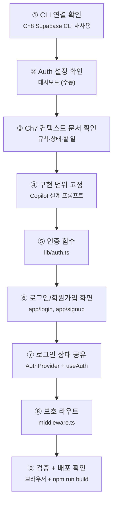

# Chapter 9. Supabase Authentication

# Chapter 9. Supabase Authentication

챕터별로 새로운 세션으로 시작하며 아래의 프롬프트로 시작한다.  " 이 프로젝트를 검토 이해한다. 오늘은 ch9A.md 작업을 수행한다.  응답은 한국어로 하고 설명은 이해하기 쉽게 한다.  "

> **미션**: 내 블로그(`my-first-web`)에 이메일/비밀번호 로그인, 회원가입, 로그아웃을 연결한다
> 

---

## 이 장의 흐름

이번 장은 **핵심 코드는 최소로 읽고, 구현은 바이브코딩으로 진행**한다. 직접 손이 필요한 것은 Supabase 대시보드 설정 확인과 브라우저 테스트뿐이다.



| 단계 | 작업 | 도구 | 절 |
| --- | --- | --- | --- |
| ① | Ch8 Supabase CLI 연결 재확인 | Supabase CLI | 9.2 |
| ② | Email Provider, URL Configuration 확인 | 대시보드 (수동) | 9.3 |
| ③ | Ch7 컨텍스트 문서 검토 | Copilot + 문서 | 9.4 |
| ④ | 인증 흐름과 파일 범위 고정 | Copilot | 9.5 |
| ⑤ | 로그인/회원가입/로그아웃 함수 작성 | Copilot | 9.6 |
| ⑥ | 로그인/회원가입 페이지 작성 | Copilot | 9.7 |
| ⑦ | AuthProvider와 Header UI 연결 | Copilot | 9.8 |
| ⑧ | 보호 라우트 설정 (`middleware.ts`) | Copilot | 9.9 |
| ⑨ | 시나리오 검증 + 빌드 | 브라우저 + 터미널 | 9.10 |

**고정 버전** (Ch7·Ch8 교재 기준):

| 패키지 | 버전 |
| --- | --- |
| `next` | 16.2.1 |
| `@supabase/supabase-js` | 2.47.12 |
| `@supabase/ssr` | 0.5.2 |

> **기준 명시**: 이 장의 코드·패키지 버전은 최신 npm 기준이 아니라 **Ch7·Ch8 교재 기준에 맞춘다**. 단, Supabase 대시보드 메뉴 경로는 2026년 5월 현재 화면 기준으로 안내한다. Ch8에서 사용한 `NEXT_PUBLIC_SUPABASE_ANON_KEY` 환경변수 이름도 그대로 유지한다.
> 

---

## 학습목표

1. 인증(Authentication)과 인가(Authorization)의 차이를 설명할 수 있다
2. Supabase Auth의 이메일/비밀번호 로그인을 프로젝트에 연결할 수 있다
3. 로그인 상태를 전역 UI에서 사용할 수 있다
4. 로그인하지 않은 사용자의 글쓰기 접근을 막을 수 있다

---

## 9.1 왜 인증인가?

Ch8에서는 더미 데이터를 Supabase 데이터베이스로 교체했다. 이제 블로그에 글을 쓰려면 **누가 쓴 글인지** 알아야 한다. 이것이 인증이다.

> **원리 — 인증(Authentication) vs 인가(Authorization)**
> 

>

> | 구분 | 인증 | 인가 | | --- | --- | --- | | 질문 | "당신은 누구인가?" | "당신은 무엇을 할 수 있는가?" | | 예시 | 로그인 | 내 글만 수정 가능 | | 이 수업에서 | Ch9 | Ch11 RLS |
> 

이번 장에서는 **이메일/비밀번호 로그인**만 다룬다. Google, 카카오, 네이버 로그인은 넣지 않는다. 기능을 늘리기보다 먼저 가장 단순한 인증 흐름을 끝까지 연결한다.

> **원리 — 세션**
> 

>

> Supabase Auth는 로그인 성공 후 세션을 만든다. Next.js App Router에서는 `@supabase/ssr`가 쿠키 기반 세션 처리를 돕는다. 그래서 이 장의 프롬프트에는 항상 `@supabase/ssr`와 App Router를 명시한다.
> 

---

## 9.2 Ch8 Supabase CLI 연결 확인 `⌨️ CLI`

Ch8에서 Supabase CLI를 이미 설치하고 로그인·프로젝트 링크까지 했다. Ch9도 같은 Supabase 프로젝트를 이어서 사용하므로, 대시보드로 가기 전에 CLI 연결 상태를 먼저 확인한다.

```bash
# 1) Supabase CLI가 실행되는지 확인
npx supabase --version

# 2) 내 계정의 프로젝트 목록 확인
npx supabase projects list
```

`my-first-web` 프로젝트가 보이면 Ch8에서 만든 프로젝트를 계속 사용할 수 있다.

프로젝트 참조 ID를 확인한 뒤, Ch8에서 만든 `.env.local` 값과 비교한다.

```bash
# 3) API URL과 anon key 재확인
npx supabase projects api-keys --project-ref 프로젝트참조ID

예시: npx supabase projects api-keys --project-ref citgmhsbetcguolnotlt
```

`.env.local`에는 Ch8과 같은 이름을 사용한다.

```bash
NEXT_PUBLIC_SUPABASE_URL=https://프로젝트참조ID.supabase.co
NEXT_PUBLIC_SUPABASE_ANON_KEY=eyJhbGci...
```

만약 프로젝트 링크가 끊어졌거나 다른 폴더에서 작업 중이면 다시 연결한다.

```bash
npx supabase link --project-ref 프로젝트참조ID
```

> 이 절은 Ch8에서 어렵게 설치한 Supabase CLI를 재사용하는 확인 단계다. Auth Provider 설정 자체는 메뉴 확인이 더 안전하므로 다음 절에서 대시보드로 확인한다.
> 

---

## 9.4 Ch7 기준 문서 정비와 확인 `🤖 바이브코딩`

Ch9는 Ch7에서 만든 AI 컨텍스트 문서를 이어서 사용한다. 새 기능을 만들기 전에 Copilot이 프로젝트 규칙, 현재 상태, 남은 할 일을 먼저 읽게 해야 한다. 이 절에서는 문서가 없으면 만들고, 이미 있으면 Ch9 기준과 충돌하는 내용을 정비한다.

| 문서 | 역할 | Ch9에서 정비할 것 |
| --- | --- | --- |
| `.github/copilot-instructions.md` | 코딩 규칙 | App Router, Tailwind, shadcn/ui, `next/navigation` 규칙 |
| `context.md` | 현재 상태 | Ch8 Supabase 연결 완료 여부, 환경변수 이름 |
| `todo.md` | 할 일 | 로그인/회원가입/글쓰기 보호 항목 |
| `ARCHITECTURE.md` | 프로젝트 설계 | 인증 후 페이지 흐름, Header 구조, 보호할 경로 |
| `AGENTS.md` | 여러 AI 도구 공용 규칙 | Copilot 외 도구를 쓸 때 공통 기준 |
| `CLAUDE.md` | Claude용 규칙 | Claude Code를 함께 쓸 때 Ch7·Ch8 기준 유지 |
| `.agent/rules/project.md` | Antigravity용 규칙 | Antigravity를 함께 쓸 때 프로젝트 규칙 유지 |

> 실제 `package.json`이 교재 기준보다 최신일 수 있다. 이 경우 최신 내용을 삭제하지 말고, 문서에 **교재 기준**과 **현재 설치 기준**을 함께 남긴다.
> 

### Copilot 프롬프트 1: 기준 문서 정비

```
#file:context.md #file:todo.md #file:ARCHITECTURE.md

Ch9 Supabase Auth 작업을 시작하기 전에 기준 문서들을 정비해줘.

대상:
- .github/copilot-instructions.md
- context.md
- todo.md
- ARCHITECTURE.md
- AGENTS.md
- CLAUDE.md
- .agent/rules/project.md

작업 규칙:
1. 파일이 없으면 Ch7 기준에 맞춰 새로 만들어줘.
2. 파일이 있으면 내용을 읽고 Ch9 기준과 충돌하는 부분을 찾아줘.
3. 충돌하는 부분은 바로 수정해줘.
4. 단, 기존 프로젝트 상태나 실제 package.json과 충돌할 수 있는 부분은 삭제하지 말고 "교재 기준"과 "현재 설치 기준"을 함께 적어줘.
5. 수정 후 어떤 파일을 만들었고, 어떤 파일을 바꿨는지 요약해줘.

Ch9 기준:
- 코드·패키지 설명은 Ch7·Ch8 교재 기준을 따른다.
- Next.js 16.2.1 App Router
- @supabase/supabase-js 2.47.12
- @supabase/ssr 0.5.2
- Supabase 대시보드 메뉴 안내만 2026년 5월 기준이다.
- Ch8 환경변수 이름을 유지한다:
  NEXT_PUBLIC_SUPABASE_URL
  NEXT_PUBLIC_SUPABASE_ANON_KEY
- 이메일/비밀번호 인증만 사용한다.
- 소셜 로그인은 추가하지 않는다.
- App Router만 사용한다.
- next/router, pages router는 사용하지 않는다.
- 이 교재에서는 보호 라우트 파일로 middleware.ts를 사용한다.
- Supabase Auth 로그인은 signInWithPassword를 사용한다.
- 구버전 auth.signIn()은 사용하지 않는다.
- service_role 키는 클라이언트에 절대 두지 않는다.

버전 표기는 다음 정책으로 정리해줘:

## Version Policy

- 교재 기준: Next.js 16.2.1, @supabase/supabase-js 2.47.12, @supabase/ssr 0.5.2
- 실제 package.json이 더 최신일 수 있다.
- 수업 프롬프트와 설명은 교재 기준으로 통일한다.
- 빌드 오류가 버전 차이에서 발생하면 package.json 기준으로 원인을 확인한다.

출력:
- 생성한 파일
- 수정한 파일
- 충돌해서 정리한 항목
- 아직 사람이 확인해야 할 항목
```

### Ch9에서 문서에 추가할 사항

Ch9 작업이 끝나면 아래 내용을 각 문서에 남긴다.

| 문서 | 추가할 내용 |
| --- | --- |
| `.github/copilot-instructions.md` | 이메일/비밀번호만 사용, `next/router` 금지, 구버전 `auth.signIn()` 금지 |
| `context.md` | Supabase Auth 방식, 생성한 파일, 보호 라우트, URL Configuration 설정 |
| `todo.md` | 회원가입, 로그인, 로그아웃, `/posts/new` 보호, 배포 검증 체크 |
| `ARCHITECTURE.md` | 인증 흐름, Header 상태 분기, 보호 라우트 목록 |
| `AGENTS.md` | 여러 AI 도구 공통 규칙: Ch7·Ch8 패키지 기준, Supabase 메뉴만 2026년 5월 기준 |
| `CLAUDE.md` | Claude 사용 시에도 위 공통 규칙과 Ch9 인증 범위 유지 |
| `.agent/rules/project.md` | Antigravity 사용 시 App Router, Supabase Auth, 보호 라우트 기준 유지 |

---

## 9.5 코드 변경 범위 고정 `🤖 바이브코딩`

9.4에서 정비한 기준 문서를 바탕으로, 이제 실제로 어떤 코드 파일을 만들고 수정할지만 확정한다. 이 절에서는 문서를 더 고치지 않고, 코드 변경 범위만 정리한다.

### Copilot 프롬프트 2: 파일 범위 확인

```
9.4에서 정비한 context.md, todo.md, ARCHITECTURE.md, copilot-instructions.md 기준을 반영해서
Ch9 인증 구현의 코드 변경 범위만 정리해줘.

이 프로젝트는 Ch7·Ch8 교재 기준으로 Next.js 16.2.1 App Router,
@supabase/supabase-js 2.47.12, @supabase/ssr 0.5.2를 사용한다.

Ch9 목표는 이메일/비밀번호 회원가입, 로그인, 로그아웃, 로그인 상태 유지,
그리고 /posts/new 보호 라우트 구현이다.

아직 코드는 수정하지 마.
문서 파일도 더 수정하지 마.
현재 프로젝트 구조를 확인한 뒤 실제 코드 파일의 생성/수정 목록과 각 파일의 역할만 제안해줘.

규칙:
- App Router만 사용한다.
- pages router, next/router는 사용하지 않는다.
- 소셜 로그인은 추가하지 않는다.
- 새 라이브러리는 추가하지 않는다.
- Supabase 클라이언트는 @supabase/ssr 패턴을 사용한다.
```

Copilot 답변을 받은 뒤, 아래 필수 파일들이 포함되었는지 다시 확인시킨다.

```
방금 제안한 코드 변경 범위에 아래 필수 파일이 모두 포함되어 있는지 확인해줘.

필수 확인 목록:
- lib/auth.ts: 로그인, 회원가입, 로그아웃 함수
- contexts/AuthContext.tsx 또는 components/AuthProvider.tsx: 로그인 상태 전역 공유
- app/login/page.tsx: 로그인 화면
- app/signup/page.tsx: 회원가입 화면
- app/layout.tsx: AuthProvider 연결
- app/posts/new/page.tsx: 로그인 필요 화면
- middleware.ts: 비로그인 사용자를 /login으로 이동

출력:
- 포함된 파일
- 빠진 파일
- 현재 프로젝트 구조상 다른 경로를 써야 한다면 그 이유

아직 코드는 수정하지 마.
```

---

## 9.6 인증 함수 만들기 `🤖 바이브코딩`

이 절에서는 `lib/auth.ts`만 만든다. 핵심 함수는 3개다.

`lib/auth.ts`는 Supabase 인증 호출을 한곳에 모아 두는 파일이다. 로그인 화면과 회원가입 화면이 Supabase API를 직접 반복해서 쓰지 않고, `signInWithEmail`, `signUpWithEmail`, `signOut` 같은 쉬운 이름의 함수만 호출하게 만든다. 이렇게 해 두면 나중에 에러 처리나 함수 이름이 바뀌어도 화면 파일을 많이 고치지 않아도 된다.

### Copilot 프롬프트 3: `lib/auth.ts`

```
lib/auth.ts 파일을 만들어줘.

요구사항:
- 이메일/비밀번호 로그인: signInWithEmail(email, password)
- 이메일/비밀번호 회원가입: signUpWithEmail(email, password, name)
- 로그아웃: signOut()
- Supabase 클라이언트는 기존 lib/supabase/client.ts의 createClient()를 사용한다.
- signInWithPassword, signUp, signOut만 사용한다.
- 구버전 auth.signIn()은 사용하지 않는다.
- 에러를 숨기지 말고 호출한 컴포넌트가 처리할 수 있게 반환한다.
```

AI가 `lib/auth.ts`를 만든 뒤, 아래 패턴을 사용했는지 다시 확인시킨다.

```
방금 만든 lib/auth.ts를 검토해줘.

반드시 확인할 것:
1. 로그인은 supabase.auth.signInWithPassword({ email, password })를 사용하는가?
2. 회원가입은 supabase.auth.signUp({ email, password, options: { data: { name } } }) 패턴을 사용하는가?
3. 로그아웃은 supabase.auth.signOut()을 사용하는가?
4. 구버전 supabase.auth.signIn(...)이 남아 있지 않은가?
5. service_role 키나 서버 전용 키를 사용하지 않았는가?

문제가 있으면 바로 수정해줘.
수정 후 어떤 줄을 바꿨는지 요약해줘.
```

---

## 9.7 로그인/회원가입 화면 만들기 `🤖 바이브코딩`

화면은 예쁘게 꾸미기보다 먼저 동작해야 한다. 입력칸, 버튼, 에러 메시지, 이동만 있으면 된다.

로그인 페이지와 회원가입 페이지는 사용자가 인증 기능을 실제로 만나는 입구다. 이 화면들은 Supabase 로직을 직접 길게 쓰기보다 9.6에서 만든 `lib/auth.ts` 함수를 호출하는 역할만 맡는다. 그래서 화면 파일은 입력값 관리, 버튼 클릭, 성공 후 이동, 실패 메시지 표시 정도로 단순하게 유지한다.

### Copilot 프롬프트 4: 로그인 페이지

```
app/login/page.tsx를 만들어줘.

요구사항:
- "use client" 컴포넌트
- email, password 입력
- 로그인 버튼 클릭 시 lib/auth.ts의 signInWithEmail 호출
- 성공하면 /posts로 이동
- 실패하면 화면에 에러 메시지 표시
- 이미 로그인/회원가입 관련 새 라이브러리는 추가하지 않는다.
- App Router의 useRouter는 next/navigation에서 가져온다.
```

### Copilot 프롬프트 5: 회원가입 페이지

```
app/signup/page.tsx를 만들어줘.

요구사항:
- "use client" 컴포넌트
- name, email, password 입력
- 회원가입 버튼 클릭 시 lib/auth.ts의 signUpWithEmail 호출
- 성공하면 /login으로 이동하거나 "가입 완료. 로그인하세요." 메시지 표시
- 실패하면 화면에 에러 메시지 표시
- App Router의 useRouter는 next/navigation에서 가져온다.
```

브라우저에서 확인:

```bash
npm run dev
```

아래 주소를 연다.

```
http://localhost:3000/signup
http://localhost:3000/login
```

---

## 9.8 로그인 상태를 전역으로 연결 `🤖 바이브코딩`

로그인 여부는 여러 곳에서 필요하다. Header에는 로그인/로그아웃 버튼이 필요하고, 글쓰기 페이지는 로그인 여부를 알아야 한다.

`AuthProvider`는 앱 전체에 “현재 로그인한 사용자” 정보를 공급하는 감싸개 컴포넌트다. `contexts/AuthContext.tsx`는 그 정보를 담는 React Context 파일이고, `useAuth()`는 여러 컴포넌트가 같은 방식으로 로그인 상태를 읽게 해 주는 Hook이다. 이 구조가 없으면 Header, 글쓰기 페이지, 로그아웃 버튼마다 Supabase 세션 확인 코드를 반복해야 한다.

이 파일이 필요한 이유는 세 가지다. 첫째, 새로고침 후에도 현재 사용자를 다시 확인한다. 둘째, 로그인/로그아웃이 일어났을 때 화면 상태를 즉시 바꾼다. 셋째, 인증 상태 확인 중에는 `loading`으로 처리해 버튼이나 보호 화면이 성급하게 보이지 않게 한다.

### Copilot 프롬프트 6: AuthProvider

```
인증 상태를 전역으로 공유하는 AuthProvider와 useAuth Hook을 만들어줘.

요구사항:
- 위치는 contexts/AuthContext.tsx로 한다.
- "use client" 컴포넌트로 작성한다.
- 제공할 값: user, loading, signInWithEmail, signUpWithEmail, signOut
- 앱 시작 시 supabase.auth.getUser()로 현재 사용자 확인
- supabase.auth.onAuthStateChange()로 로그인/로그아웃 변화 감지
- useEffect cleanup에서 subscription.unsubscribe()를 반드시 호출
- app/layout.tsx에서 AuthProvider로 children을 감싼다.
```

### Copilot 프롬프트 6a: contexts/AuthContext.tsx 생성

```
파일: contexts/AuthContext.tsx

요구사항:
- "use client" 컴포넌트
- `supabase` 브라우저 클라이언트는 `lib/supabase/client.ts`의 `createClient()`를 사용하거나 프로젝트의 AuthProvider 패턴에 일치하도록 사용
- 제공할 값: `user`, `loading`, `signInWithEmail`, `signUpWithEmail`, `signOut`
- 앱 시작 시 `supabase.auth.getUser()`로 초기 사용자 상태를 확인
- `supabase.auth.onAuthStateChange()`로 로그인/로그아웃 변화 감지
- `useEffect` cleanup에서 `subscription.unsubscribe()`를 반드시 호출
- `signInWithEmail`, `signUpWithEmail`, `signOut`는 내부에서 `lib/auth.ts`의 함수를 호출하도록 바인딩
- 타입스크립트로 작성하되 너무 엄격한 타입 검사는 피함 (실습용)

출력:
- 생성한 파일 경로: `contexts/AuthContext.tsx`
- 제공되는 훅: `useAuth()`
- 예시 사용법: `const { user, loading, signOut } = useAuth();`
```

AuthProvider를 만든 뒤, 인증 리스너 정리가 들어갔는지 Copilot에게 다시 확인시킨다.

```
방금 만든 AuthProvider/useAuth 코드를 검토해줘.

반드시 확인할 것:
1. supabase.auth.getUser()로 초기 사용자 상태를 확인하는가?
2. supabase.auth.onAuthStateChange()로 로그인/로그아웃 변화를 감지하는가?
3. useEffect cleanup에서 return () => subscription.unsubscribe();를 호출하는가?
4. loading 상태가 초기 세션 확인 후 false로 바뀌는가?
5. AuthProvider가 app/layout.tsx에서 children을 감싸는가?

문제가 있으면 바로 수정해줘.
수정 후 어떤 파일과 어떤 부분을 바꿨는지 요약해줘.
```

### Copilot 프롬프트 7: Header 로그인 버튼

Header는 사용자가 현재 로그인 상태를 가장 빨리 확인하는 위치다. 로그인 전에는 로그인/회원가입을 보여주고, 로그인 후에는 글쓰기/로그아웃을 보여주면 앱의 흐름이 자연스러워진다. 이 분기는 보안이 아니라 사용자 경험이다. 실제 데이터 권한은 Ch11 RLS에서 처리한다.

```
현재 프로젝트의 Header 또는 상단 내비게이션 컴포넌트를 찾아서
useAuth() 기반 로그인/로그아웃 UI를 추가해줘.

요구사항:
- loading 중에는 버튼을 비활성화하거나 간단한 로딩 표시
- user가 있으면: 글쓰기 링크(/posts/new), 로그아웃 버튼
- user가 없으면: 로그인 링크(/login), 회원가입 링크(/signup)
- 로그아웃 성공 후 / 로 이동
- 기존 디자인 스타일을 크게 바꾸지 않는다.
```

---

## 9.9 보호 라우트 만들기 `🤖 바이브코딩`

이번 장에서는 `/posts/new`만 보호해도 충분하다. `/mypage`가 있는 학생은 함께 보호한다.

이 장은 Ch7·Ch8 교재 흐름에 맞춰 `middleware.ts`로 보호 라우트를 만든다.

**미들웨어란?** 사용자가 페이지에 도착하기 **전에** 실행되는 검사 코드다. 예를 들어 비로그인 사용자가 `/posts/new`에 들어가려고 하면, 페이지를 보여주기 전에 먼저 `/login`으로 돌려보낼 수 있다.

### Copilot 프롬프트 8: 미들웨어

```
middleware.ts를 프로젝트 루트에 만들어줘.

목표:
- 로그인하지 않은 사용자가 /posts/new에 접근하면 /login으로 보낸다.
- /mypage 경로가 있다면 /mypage/:path*도 보호한다.

요구사항:
- @supabase/ssr의 createServerClient를 사용한다.
- NextRequest, NextResponse를 사용한다.
- 환경변수는 Ch8에서 만든 NEXT_PUBLIC_SUPABASE_URL,
  NEXT_PUBLIC_SUPABASE_ANON_KEY를 사용한다.
- App Router 기준으로 작성한다.
- middleware.ts는 app/ 폴더 안이 아니라 프로젝트 루트에 둔다.
```

미들웨어를 만든 뒤, 보호 경로와 파일 위치가 맞는지 Copilot에게 다시 확인시킨다.

```
방금 만든 middleware.ts를 검토해줘.

반드시 확인할 것:
1. middleware.ts가 app/ 폴더 안이 아니라 프로젝트 루트에 있는가?
2. @supabase/ssr의 createServerClient를 사용하는가?
3. NEXT_PUBLIC_SUPABASE_URL, NEXT_PUBLIC_SUPABASE_ANON_KEY를 사용하는가?
4. 비로그인 사용자를 /login으로 리다이렉트하는가?
5. matcher에 /posts/new가 포함되어 있는가?
6. /mypage 경로가 프로젝트에 없다면 matcher에서 /mypage/:path*를 빼도 되는지 판단했는가?

문제가 있으면 바로 수정해줘.
수정 후 어떤 파일과 어떤 부분을 바꿨는지 요약해줘.
```

> 미들웨어는 "로그인했는가?"만 확인한다. "내 글만 수정 가능한가?" 같은 권한 검사는 Ch11 RLS에서 처리한다.
> 

---

## 9.10 검증 `⌨️ 터미널 + 브라우저`

구현이 끝났다고 바로 넘어가지 않는다. 브라우저에서 아래 6개를 확인한 뒤, 결과를 Copilot에게 요약 점검시킨다.

### 9.10.1 브라우저 검증

| 번호 | 시나리오 | 기대 결과 |
| --- | --- | --- |
| ① | `/signup`에서 새 계정 생성 | 가입 성공 또는 확인 메일 안내 |
| ② | `/login`에서 로그인 | `/posts`로 이동 |
| ③ | 새로고침 | 로그인 상태 유지 |
| ④ | Header의 로그아웃 클릭 | 로그아웃 후 로그인 버튼 표시 |
| ⑤ | 비로그인 상태에서 `/posts/new` 접속 | `/login`으로 이동 |
| ⑥ | 로그인 상태에서 `/posts/new` 접속 | 글쓰기 화면 진입 |

```
아래 브라우저 검증 결과를 보고 누락된 테스트나 의심 지점을 알려줘.

1. /signup 새 계정 생성:
2. /login 로그인:
3. 새로고침 후 로그인 유지:
4. Header 로그아웃:
5. 비로그인 /posts/new 접근:
6. 로그인 /posts/new 접근:

출력:
- 통과한 항목
- 실패한 항목
- 추가 확인이 필요한 항목
- 수정이 필요하다면 의심 파일
```

### 9.10.2 터미널 검증

```bash
npm run build
```

구버전 API가 섞였는지 확인:

```bash
git grep -nE "auth\.signIn\(" -- 'app/**' 'lib/**' 'contexts/**' 2>/dev/null
```

민감한 키가 코드에 들어갔는지 확인:

```bash
git grep -nE "sb_secret_|service_role|sbp_" -- 'app/**' 'lib/**' 'contexts/**' 'middleware.ts' 2>/dev/null
```

두 명령을 실행한 뒤 결과를 Copilot에게 판정시킨다.

```
아래 터미널 검증 결과를 판정해줘.

1. npm run build 결과:
(여기에 결과 붙여넣기)

2. 구버전 API grep 결과:
(여기에 결과 붙여넣기)

3. 민감한 키 grep 결과:
(여기에 결과 붙여넣기)

판정 기준:
- build는 성공해야 한다.
- auth.signIn 검색 결과는 없어야 한다.
- sb_secret_, service_role, sbp_ 검색 결과는 없어야 한다.

문제가 있으면 원인과 수정할 파일을 제안해줘.
```

---

## 흔한 AI 실수

| 실수 | 증상 | 해결 |
| --- | --- | --- |
| `auth.signIn()` 사용 | 로그인 함수가 동작하지 않음 | `signInWithPassword()` 사용 |
| `next/router` 사용 | App Router에서 에러 | `next/navigation` 사용 |
| `@supabase/supabase-js`로 직접 브라우저 클라이언트 생성 | 세션 관리 꼬임 | Ch8의 `lib/supabase/client.ts` 사용 |
| `subscription.unsubscribe()` 누락 | 로그인 이벤트 중복 처리 | useEffect cleanup 추가 |
| `middleware.ts`를 `app/` 안에 생성 | 보호 라우트 작동 안 함 | 프로젝트 루트로 이동 |
| `service_role` 키 사용 | 보안 위험 | 브라우저와 미들웨어에는 anon 키만 |
| 소셜 로그인까지 추가 | 범위 증가, 설정 실패 | 이번 장은 이메일/비밀번호만 |

위 실수 목록도 Copilot에게 점검시킨다.

```
Ch9 흔한 AI 실수 목록을 기준으로 현재 코드를 점검해줘.

점검할 것:
1. auth.signIn()을 사용한 곳이 있는가?
2. next/router 또는 pages router를 사용한 곳이 있는가?
3. @supabase/supabase-js에서 직접 createClient를 만들어 브라우저 세션을 처리한 곳이 있는가?
4. onAuthStateChange cleanup에서 subscription.unsubscribe()가 빠진 곳이 있는가?
5. middleware.ts가 프로젝트 루트가 아니라 app/ 안에 있는가?
6. service_role 키나 서버 전용 키를 클라이언트에서 사용한 곳이 있는가?
7. 이메일/비밀번호 외 소셜 로그인 코드가 섞였는가?

문제가 있으면 바로 수정해줘.
수정 후 어떤 파일과 어떤 항목을 고쳤는지 요약해줘.
```

---

## Vercel 배포 전 확인

Ch8에서 등록한 Supabase 환경변수가 Vercel에도 있어야 한다.

먼저 Vercel CLI로 프로젝트 연결, 배포 목록, 환경변수 등록 여부를 확인한다.

```bash
vercel --version
vercel ls
vercel env ls
```

Copilot에게 명령 실행과 판정을 함께 시킨다.

```
터미널에서 아래 명령을 직접 실행하고 결과를 판정해줘.

실행할 명령:
1. vercel --version
2. vercel ls
3. vercel env ls

판정 기준:
- 현재 로컬 프로젝트가 올바른 Vercel 프로젝트와 연결되어 있는가?
- 배포 목록이 확인되는가?
- NEXT_PUBLIC_SUPABASE_URL 환경변수가 있는가?
- NEXT_PUBLIC_SUPABASE_ANON_KEY 환경변수가 있는가?
- production, preview 환경에 필요한 값이 빠지지 않았는가?

문제가 있으면 어떤 명령이나 대시보드 화면에서 수정해야 하는지 알려줘.
단, 환경변수의 실제 값은 CLI 출력만으로 단정하지 말고 대시보드에서 눈으로 확인하라고 안내해줘.
터미널 실행 권한이 없으면, 실행하지 못한 명령을 알려주고 내가 결과를 붙여 넣을 수 있게 요청해줘.
```

CLI 확인 뒤에는 사람이 대시보드에서 한 번 더 눈으로 확인한다.

Vercel 대시보드:

```
Project → Settings → Environment Variables
```

필수 값:

```bash
NEXT_PUBLIC_SUPABASE_URL=https://프로젝트참조ID.supabase.co
NEXT_PUBLIC_SUPABASE_ANON_KEY=...
```

Supabase 대시보드:

```
Authentication → URL Configuration
```

눈으로 확인할 것:

1. Vercel 환경변수 이름이 정확한가?
2. `NEXT_PUBLIC_SUPABASE_URL` 값이 Ch8 Supabase 프로젝트 URL과 같은가?
3. `NEXT_PUBLIC_SUPABASE_ANON_KEY` 값이 Ch8 anon key와 같은가?
4. Supabase URL Configuration의 Site URL이 현재 수업 흐름과 맞는가?

환경변수나 URL 설정을 바꾼 뒤에는 다시 배포해야 한다.

```bash
git add .
git commit -m "ch9: add supabase auth"
git push
```

---

## 핵심 정리 + B회차 과제 스펙

### 이번 시간 핵심 3가지

1. **인증**은 "누구인가?"를 확인한다. 권한 검사는 Ch11 RLS에서 다룬다.
2. Supabase 이메일 로그인은 `signInWithPassword`, 회원가입은 `signUp`, 로그아웃은 `signOut`이다.
3. 복잡한 코드를 외우지 않는다. App Router, `@supabase/ssr`, 보호 경로, 검증 시나리오를 프롬프트에 정확히 넣는다.

### B회차 과제 스펙

1. `npx supabase projects list`로 Ch8 프로젝트 연결 확인
2. `npx supabase projects api-keys`로 `.env.local` 값 재확인
3. Supabase 대시보드에서 Email Provider 확인
4. URL Configuration에서 Site URL 확인, Redirect URLs는 필요할 때만 추가
5. `lib/auth.ts` 작성
6. `app/login/page.tsx` 작성
7. `app/signup/page.tsx` 작성
8. `AuthProvider + useAuth` 작성 후 `app/layout.tsx`에 연결
9. Header에 로그인/회원가입/글쓰기/로그아웃 UI 연결
10. `middleware.ts`로 `/posts/new` 보호
11. 회원가입 → 로그인 → 새로고침 유지 → 로그아웃 → 비로그인 접근 차단 테스트
12. `npm run build` 통과 후 GitHub/Vercel 배포

### 제출 항목

```
1. GitHub 저장소 URL
2. Vercel 배포 URL
3. 로그인 화면 스크린샷
4. 회원가입 화면 스크린샷
5. 로그인 후 Header에 글쓰기/로그아웃이 보이는 화면 스크린샷
6. 로그아웃 후 Header에 로그인/회원가입이 보이는 화면 스크린샷
7. 비로그인 상태에서 /posts/new 접근 시 /login으로 이동한 화면 스크린샷
8. npm run build 성공 결과 또는 터미널 캡처
9. auth.signIn grep 결과 캡처
10. 민감 키 grep 결과 캡처
```

교사는 GitHub에서 `lib/auth.ts`, `app/login/page.tsx`, `app/signup/page.tsx`, `contexts/AuthContext.tsx` 또는 AuthProvider 파일, `app/layout.tsx`, Header 컴포넌트, `middleware.ts`를 확인한다. Vercel에서는 회원가입, 로그인, 새로고침 후 세션 유지, 로그아웃, 비로그인 `/posts/new` 접근 차단이 실제 배포 URL에서 동작하는지 확인한다.

### 제출 전 체크

```bash
npm run build
git grep -nE "auth\.signIn\(" -- 'app/**' 'lib/**' 'contexts/**' 2>/dev/null
git grep -nE "sb_secret_|service_role|sbp_" -- 'app/**' 'lib/**' 'contexts/**' 'middleware.ts' 2>/dev/null
```

제출 전 체크 결과도 Copilot에게 판정시킨다.

```
제출 전 체크 결과를 판정해줘.

1. npm run build:
(결과 붙여넣기)

2. auth.signIn grep:
(결과 붙여넣기)

3. 민감한 키 grep:
(결과 붙여넣기)

통과/실패/추가 확인 필요로 나눠서 알려줘.
```

### 컨텍스트 업데이트

작업을 마칠 때 Copilot에게 붙여 넣는다.

```
Ch9 Supabase Auth 작업을 마무리하려고 해.

Ch7에서 만든 문서들을 업데이트해줘.

1. context.md
- 인증: Supabase Auth 이메일/비밀번호
- 환경변수: NEXT_PUBLIC_SUPABASE_URL, NEXT_PUBLIC_SUPABASE_ANON_KEY
- Ch8 Supabase CLI 연결 확인: projects list, projects api-keys
- 생성/수정 파일: lib/auth.ts, app/login/page.tsx, app/signup/page.tsx,
  AuthProvider/useAuth 파일, Header, middleware.ts
- 보호 라우트: /posts/new
- Supabase 대시보드: Authentication -> Sign In / Providers -> Email,
  Authentication -> URL Configuration 확인

2. todo.md
- 회원가입 구현
- 로그인 구현
- 로그아웃 구현
- Header 로그인 상태 분기
- /posts/new 보호
- npm run build 검증
- Vercel 배포 URL 검증

3. ARCHITECTURE.md
- 인증 흐름: signup -> login -> posts
- Header 상태 분기: 비로그인(로그인/회원가입), 로그인(글쓰기/로그아웃)
- 보호 라우트 목록

4. .github/copilot-instructions.md 또는 AGENTS.md
- Ch9 기준 추가: 이메일/비밀번호만 사용, 소셜 로그인 추가 금지
- App Router만 사용, next/router 금지
- Supabase Auth는 signInWithPassword 사용, 구버전 auth.signIn() 금지
- 패키지 버전은 Ch7·Ch8 교재 기준을 따른다.
- Supabase 대시보드 메뉴 안내만 2026년 5월 기준이다.

파일이 없으면 Ch7 기준에 맞춰 새로 만들고, 이미 있으면 Ch9 작업 결과와 충돌하는 부분만 정리해줘.
```

---

## 참고한 공식 문서

- Supabase Auth: https://supabase.com/docs/guides/auth
- Supabase SSR: https://supabase.com/docs/guides/auth/server-side
- Supabase Next.js Auth: https://supabase.com/docs/guides/auth/quickstarts/nextjs
- Supabase Redirect URLs: https://supabase.com/docs/guides/auth/redirect-urls