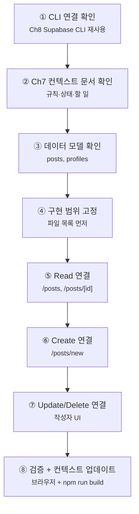

# Chapter 10. Supabase CRUD

# Chapter 10. Supabase Database CRUD

> **미션**: 내 블로그(`my-first-web`)에서 게시글 목록, 상세, 작성, 수정, 삭제를 연결한다
> 

---

## 이 장의 흐름

이번 장도 Ch9와 같은 방식으로 진행한다. **핵심 코드는 최소로 읽고, 화면 단위로 Copilot에게 구현을 맡긴다.** Ch8에서 만든 Supabase CLI 연결과 Ch9에서 만든 인증 상태를 그대로 이어서 사용한다.



| 단계 | 작업 | 도구 | 절 |
| --- | --- | --- | --- |
| ① | Ch8 Supabase CLI 연결 재확인 | Supabase CLI | 10.2 |
| ② | Ch7 컨텍스트 문서 검토 | Copilot + 문서 | 10.3 |
| ③ | `posts`, `profiles` 스키마 확인 | Supabase CLI + 코드 | 10.4 |
| ④ | CRUD 파일 범위 고정 | Copilot | 10.5 |
| ⑤ | 목록/상세 조회 연결 | Copilot | 10.6 |
| ⑥ | 글 작성 연결 | Copilot | 10.7 |
| ⑦ | 수정/삭제 UI 연결 | Copilot | 10.8 |
| ⑧ | 검증 + 문서 업데이트 | 브라우저 + 터미널 | 10.9 |

**고정 버전** (Ch7·Ch8 교재 기준):

| 패키지 | 버전 |
| --- | --- |
| `next` | 16.2.1 |
| `@supabase/supabase-js` | 2.47.12 |
| `@supabase/ssr` | 0.5.2 |

> **기준 명시**: 이 장의 코드·패키지 버전은 최신 npm 기준이 아니라 **Ch7·Ch8 교재 기준에 맞춘다**. Ch8에서 만든 `lib/supabase/client.ts`, Ch9에서 만든 인증 흐름을 그대로 사용한다.
> 

---

## 학습목표

1. CRUD가 Create, Read, Update, Delete의 약자임을 설명할 수 있다
2. Supabase 클라이언트의 `select`, `insert`, `update`, `delete` 패턴을 읽을 수 있다
3. 게시글 목록, 상세, 작성, 수정, 삭제 화면을 연결할 수 있다
4. 작성자 UI와 실제 보안(RLS)의 차이를 구분할 수 있다

---

## 10.1 왜 CRUD인가?

Ch8에서는 데이터베이스를 연결했고, Ch9에서는 로그인한 사용자를 알 수 있게 했다. 이제 블로그의 핵심 기능인 **글을 읽고, 쓰고, 고치고, 지우는 흐름**을 연결한다.

| 기능 | 영어 | 화면 |
| --- | --- | --- |
| 생성 | Create | `/posts/new` |
| 조회 | Read | `/posts`, `/posts/[id]` |
| 수정 | Update | `/posts/[id]/edit` 또는 상세 화면 내부 |
| 삭제 | Delete | 상세 화면의 삭제 버튼 |

> 이번 장의 수정/삭제 버튼 숨김은 **UX**다. “작성자만 수정·삭제 가능”을 실제로 강제하는 보안은 Ch11 RLS에서 처리한다.
> 

---

## 10.2 Ch8 Supabase CLI 연결 확인 `⌨️ CLI`

CRUD는 Ch8에서 만든 `posts` 테이블에 연결된다. 먼저 같은 Supabase 프로젝트를 보고 있는지 확인한다.

```bash
npx supabase --version
npx supabase projects list
```

프로젝트 참조 ID가 헷갈리면 API 키를 다시 확인한다.

```bash
npx supabase projects api-keys --project-ref "프로젝트참조ID"
```

`.env.local`은 Ch8과 같은 이름을 유지한다.

```bash
NEXT_PUBLIC_SUPABASE_URL=https://프로젝트참조ID.supabase.co
NEXT_PUBLIC_SUPABASE_ANON_KEY=eyJhbGci...
```

---

## 10.3 프로젝트 기준 문서 정비와 확인 `🤖 바이브코딩`

Ch10은 새 주에 진행하므로 Ch8 Supabase 연결, Ch9 인증 구현 상태를 잊었을 수 있다. 시작 전에 Copilot에게 기준 문서를 정비 하고, 없으면 Ch7 기준으로 만들어야 한다.

```
#file:context.md #file:todo.md #file:ARCHITECTURE.md

Ch10 게시글 CRUD 작업을 시작하기 전에 기준 문서와 프로젝트 환경을 정비해줘.

대상:
- .github/copilot-instructions.md
- context.md
- todo.md
- ARCHITECTURE.md
- AGENTS.md
- CLAUDE.md
- .agent/rules/project.md

작업 규칙:
1. 파일이 없으면 Ch7 기준으로 새로 만들어줘.
2. 파일이 있으면 Ch10 기준과 충돌하는 부분을 바로 수정해줘.
3. 실제 package.json이 교재 기준보다 최신이면 삭제하지 말고 "교재 기준"과 "현재 설치 기준"을 함께 적어줘.
4. Ch8 Supabase 연결, Ch9 인증 구현, posts CRUD 할 일을 문서에 반영해줘.

Ch10 기준:
- Ch7·Ch8 교재 기준 패키지를 따른다.
- Ch8의 lib/supabase/client.ts를 사용한다.
- Ch9의 useAuth/AuthProvider를 사용한다.
- posts 컬럼명은 Ch8 스키마 그대로 사용한다.
- App Router만 사용하고 next/router는 금지한다.
- 수정/삭제 UI는 UX이고, 실제 보안은 Ch11 RLS에서 처리한다.

출력:
- 생성한 파일
- 수정한 파일
- Ch10 시작 전에 사람이 확인할 항목
```

---

## 10.4 데이터 모델 확인 `⌨️ CLI + 코드 읽기`

Ch8에서 만든 테이블 기준으로 진행한다.

| 테이블 | 주요 컬럼 | 역할 |
| --- | --- | --- |
| `profiles` | `id`, `username`, `avatar_url`, `role` | 사용자 추가 정보 |
| `posts` | `id`, `user_id`, `title`, `content`, `created_at` | 블로그 게시글 |

Copilot에게 이 스키마를 반드시 알려준다. AI가 `authorId`, `body`, `users` 같은 다른 이름을 만들지 못하게 막기 위해서다.

```
데이터 모델은 Ch8 기준을 따른다.

posts:
- id uuid primary key
- user_id uuid references profiles(id)
- title text
- content text
- created_at timestamptz

profiles:
- id uuid primary key, auth.users(id) 참조
- username text
- avatar_url text
- role text

위 컬럼명을 임의로 바꾸지 마.
```

---

## 10.5 구현 범위 고정 `🤖 바이브코딩`

먼저 Copilot에게 파일 목록만 받는다.

CRUD는 한 번에 전체 코드를 만들기보다 화면과 역할을 나누어 진행해야 한다. 목록, 상세, 작성, 수정/삭제는 서로 연결되어 있지만 실패 지점이 다르다. 먼저 어떤 파일을 만들고 어떤 파일을 수정할지 고정하면 AI가 스키마를 바꾸거나 새 구조를 과하게 만드는 일을 줄일 수 있다.

```
Ch10 게시글 CRUD를 구현하려고 해.

먼저 코드는 수정하지 말고, 현재 프로젝트 구조를 확인한 뒤
생성/수정할 파일 목록과 각 파일의 역할만 제안해줘.

요구사항:
- 목록: /posts
- 상세: /posts/[id]
- 작성: /posts/new
- 수정/삭제: 기존 구조에 맞춰 제안
- Supabase 클라이언트는 Ch8의 lib/supabase/client.ts 사용
- 인증 상태는 Ch9의 useAuth/AuthProvider 사용
- App Router만 사용, next/router 금지
- 새 라이브러리 추가 금지
- 테이블/컬럼명은 Ch8 스키마 그대로 사용
```

Copilot 답변을 받은 뒤, 필수 코드 파일 범위가 포함되었는지 다시 확인시킨다.

```
방금 제안한 Ch10 코드 변경 범위를 검토해줘.

필수 확인 목록:
- app/posts/page.tsx: 게시글 목록
- app/posts/[id]/page.tsx: 게시글 상세
- app/posts/new/page.tsx: 게시글 작성
- lib/posts.ts 또는 기존 구조에 맞는 Supabase CRUD 함수 파일
- components/PostForm.tsx 또는 기존 구조에 맞는 작성/수정 폼

문서 파일은 더 수정하지 말고, 실제 코드 파일 범위만 판정해줘.
빠진 파일이 있으면 추가 제안해줘.
```

---

## 10.6 Read: 목록과 상세 연결 `🤖 바이브코딩`

Read는 CRUD의 첫 단계이며, 데이터를 “저장하기 전에 잘 읽을 수 있는지” 확인하는 과정이다. 목록 페이지는 여러 글을 최신순으로 보여주고, 상세 페이지는 하나의 글을 정확히 찾아 보여준다. 이 단계에서는 쓰기 기능보다 컬럼명, 정렬, 없는 글 처리처럼 기본 조회 흐름을 안정시키는 것이 중요하다.

### Copilot 프롬프트 1: 목록

```
app/posts/page.tsx에서 Supabase posts 목록을 조회하도록 연결해줘.

요구사항:
- Ch8의 createClient() 사용
- posts 테이블에서 id, title, content, created_at, user_id 조회
- 최신순: created_at 내림차순
- 로딩/에러/빈 상태는 최소 문구로 표시
- 각 글은 /posts/[id]로 이동하는 링크 제공
- 테이블/컬럼명 임의 변경 금지
```

목록/상세 코드를 만든 뒤 Copilot에게 쿼리 패턴을 검토시킨다.

```
방금 만든 목록/상세 조회 코드를 검토해줘.

반드시 확인할 것:
1. posts 테이블을 조회하는가?
2. 목록은 created_at 내림차순 정렬을 사용하는가?
3. 없는 상세 글은 notFound() 또는 사용자 안내로 처리하는가?
4. Ch8 컬럼명(id, user_id, title, content, created_at)을 임의 변경하지 않았는가?

문제가 있으면 바로 수정하고, 수정한 파일을 요약해줘.
```

### Copilot 프롬프트 2: 상세

```
app/posts/[id]/page.tsx에서 게시글 1개를 조회하도록 연결해줘.

요구사항:
- params의 id로 posts.id 조회
- 없는 글이면 notFound() 처리
- title, content, created_at 표시
- 로그인한 사용자가 작성자라면 수정/삭제 버튼 표시
- 보안은 Ch11 RLS에서 처리하므로, 여기서는 UI 분기만 한다
```

---

## 10.7 Create: 글 작성 연결 `🤖 바이브코딩`

Ch9에서 `/posts/new`는 로그인 필요 경로로 보호했다. 이제 실제 저장을 연결한다.

Create는 사용자가 입력한 제목과 내용을 Supabase `posts` 테이블에 넣는 단계다. 여기서 가장 중요한 값은 `user_id`다. 사용자가 폼에 입력한 값을 믿지 않고, Ch9 인증 상태의 `user.id`를 코드에서 넣어야 나중에 RLS 정책과 자연스럽게 맞아떨어진다.

```
app/posts/new/page.tsx에 게시글 작성 기능을 연결해줘.

요구사항:
- "use client" 컴포넌트
- Ch9의 useAuth()로 현재 user 확인
- 로그인하지 않았으면 /login으로 이동하거나 안내
- title, content 입력 폼
- 저장 시 posts에 insert
- user_id는 user.id 사용
- 성공하면 /posts 또는 새 글 상세 페이지로 이동
- 실패하면 화면에 에러 메시지 표시
- App Router의 useRouter는 next/navigation에서 가져오기
```

작성 코드를 만든 뒤 Copilot에게 저장 패턴을 검토시킨다.

```
방금 만든 게시글 작성 코드를 검토해줘.

반드시 확인할 것:
1. user_id를 입력값으로 받지 않고 Ch9의 user.id를 사용하는가?
2. posts.insert({ title, content, user_id: user.id }) 패턴인가?
3. 비로그인 상태를 처리하는가?
4. 성공 후 /posts 또는 상세 페이지로 이동하는가?
5. 실패 시 사용자 메시지를 표시하는가?

문제가 있으면 바로 수정하고, 수정한 파일을 요약해줘.
```

---

## 10.8 Update/Delete: 수정과 삭제 UI 연결 `🤖 바이브코딩`

이번 장에서는 작성자에게만 수정/삭제 UI를 보여준다. 실제 권한 강제는 Ch11 RLS에서 한다.

Update와 Delete는 데이터를 바꾸거나 지우는 기능이라 조회보다 위험하다. 그래서 반드시 어떤 글을 바꿀지 `.eq("id", postId)` 같은 조건을 명확히 붙여야 한다. 또 작성자에게만 버튼을 보여주는 것은 화면 편의일 뿐이고, 브라우저 요청을 조작하면 우회할 수 있으므로 실제 보안은 Ch11에서 데이터베이스 정책으로 다시 막는다.

```
게시글 상세 화면에 수정/삭제 기능을 추가해줘.

요구사항:
- 현재 로그인 사용자 id와 post.user_id가 같을 때만 수정/삭제 버튼 표시
- 수정은 title/content를 바꾸고 posts.update().eq("id", post.id) 사용
- 삭제는 확인 창을 띄운 뒤 posts.delete().eq("id", post.id) 사용
- 성공 후 목록으로 이동
- 실패하면 사용자 친화적 에러 메시지 표시
- 클라이언트 if문을 보안이라고 설명하지 말 것. Ch11 RLS가 실제 보안임을 주석/문구로 남길 것
```

수정/삭제 코드를 만든 뒤 Copilot에게 조건과 UX를 검토시킨다.

```
방금 만든 수정/삭제 코드를 검토해줘.

반드시 확인할 것:
1. update/delete에 반드시 .eq("id", postId) 조건이 있는가?
2. 작성자에게만 수정/삭제 UI를 보여주는가?
3. 삭제 전 확인 절차가 있는가?
4. 이 UI 분기를 보안이라고 설명하지 않고, Ch11 RLS가 실제 보안이라고 남겼는가?

문제가 있으면 바로 수정하고, 수정한 파일을 요약해줘.
```

---

## 10.9 검증 `⌨️ 터미널 + 브라우저`

### 브라우저 검증

| 번호 | 시나리오 | 기대 결과 |
| --- | --- | --- |
| ① | `/posts` 접속 | 게시글 목록 또는 빈 상태 표시 |
| ② | 게시글 클릭 | `/posts/[id]` 상세 이동 |
| ③ | 로그인 후 `/posts/new` 작성 | 새 글 저장 |
| ④ | 작성자 계정으로 상세 접속 | 수정/삭제 버튼 표시 |
| ⑤ | 비작성자 계정으로 상세 접속 | 수정/삭제 버튼 숨김 |
| ⑥ | 삭제 후 목록 이동 | 삭제한 글이 목록에서 사라짐 |

### 터미널 검증

> **`npm run dev` vs `npm run build`**: `dev`는 코드 작성 중 빠르게 화면을 확인하는 개발 서버다. `build`는 배포용 전체 컴파일로, TypeScript 타입 오류와 잘못된 import를 전수 검사한다. `dev`에서 멀쩡해도 `build`에서 오류가 터질 수 있으므로, 제출 전 반드시 통과시킨다. Vercel 배포도 내부적으로 `build`를 실행한다.

```bash
npm run build
```

구버전 라우터와 보안 키 노출을 확인한다.

```bash
git grep -nE "next/router|auth\.signIn\(" -- 'app/**' 'lib/**' 'components/**' 2>/dev/null
git grep -nE "service_role|SUPABASE_SERVICE_ROLE|sb_secret_|sbp_" -- 'app/**' 'lib/**' 'components/**' 2>/dev/null
```

검증 명령 실행 결과를 Copilot에게 판정시킨다.

```
Ch10 검증 결과를 판정해줘.

1. npm run build:
(결과 붙여넣기)

2. 구버전 라우터/API grep:
(결과 붙여넣기)

3. 민감 키 grep:
(결과 붙여넣기)

통과/실패/추가 확인 필요로 나누고, 문제가 있으면 수정할 파일을 제안해줘.
```

---

## 흔한 AI 실수

| 실수 | 증상 | 해결 |
| --- | --- | --- |
| `posts` 컬럼명을 임의 변경 | 저장/조회 실패 | Ch8 스키마를 프롬프트에 붙여넣기 |
| `user_id`를 입력값으로 받음 | 다른 사람 ID로 작성 가능 | `user.id`를 코드에서 넣기 |
| `next/router` 사용 | App Router 오류 | `next/navigation` 사용 |
| 수정/삭제 UI를 보안으로 오해 | 우회 가능 | Ch11 RLS에서 DB 정책 적용 |
| 로딩/빈 상태 없음 | 흰 화면처럼 보임 | 최소 문구라도 추가 |

위 실수 목록도 Copilot에게 점검시킨다.

```
Ch10 흔한 AI 실수 목록과 Ch9 이후 공통 AI 실수 목록을 기준으로 현재 코드를 점검해줘.

점검할 것:
1. posts 컬럼명을 Ch8 스키마와 다르게 사용한 곳이 있는가?
2. user_id를 폼 입력값이나 URL 값으로 받는 곳이 있는가?
3. next/router 또는 pages router를 사용한 곳이 있는가?
4. 수정/삭제 UI 분기를 보안처럼 설명한 곳이 있는가?
5. 목록/상세/작성 화면에 로딩/빈 상태가 전혀 없는가?
6. update/delete에 .eq("id", postId) 같은 조건이 빠진 곳이 있는가?
7. auth.signIn()을 사용한 곳이 있는가?
8. @supabase/supabase-js에서 직접 createClient를 만들어 브라우저 세션을 처리한 곳이 있는가?
9. onAuthStateChange cleanup에서 subscription.unsubscribe()가 빠진 곳이 있는가?
10. middleware.ts가 프로젝트 루트가 아니라 app/ 안에 있는가?
11. service_role 키나 서버 전용 키를 클라이언트에서 사용한 곳이 있는가?
12. 이메일/비밀번호 외 소셜 로그인 코드가 섞였는가?

문제가 있으면 바로 수정해줘.
수정 후 어떤 파일과 어떤 항목을 고쳤는지 요약해줘.
```

---

## 핵심 정리 + B회차 과제 스펙

### 이번 시간 핵심 3가지

1. CRUD는 화면 단위로 나누어 구현한다: 목록 → 상세 → 작성 → 수정/삭제.
2. 테이블/컬럼명을 프롬프트에 고정해야 AI가 다른 스키마를 만들지 않는다.
3. 작성자 UI 분기는 UX이고, 실제 보안은 Ch11 RLS가 담당한다.

### B회차 과제 스펙

1. Ch8 Supabase CLI 연결 확인
2. Ch7 컨텍스트 문서 확인
3. `/posts` 목록 연결
4. `/posts/[id]` 상세 연결
5. `/posts/new` 작성 연결
6. 작성자에게만 수정/삭제 UI 표시
7. `npm run build` 통과
8. GitHub push + Vercel 배포

### 과제 제출 항목

```
1. GitHub 저장소 URL
2. Vercel 배포 URL
3. /posts 목록 화면 스크린샷
4. /posts/[id] 상세 화면 스크린샷
5. 로그인 후 /posts/new 작성 성공 화면 스크린샷
6. 작성자에게만 수정/삭제 버튼이 보이는 화면 스크린샷
7. npm run build 성공 결과 또는 터미널 캡처
```

### 컨텍스트 업데이트

작업을 마칠 때 Copilot에게 붙여 넣는다.

```
Ch10 게시글 CRUD 작업을 마무리하려고 해.

Ch7에서 만든 문서들을 업데이트해줘.

1. context.md
- posts CRUD 구현 상태
- 생성/수정 파일 목록
- Supabase 쿼리 패턴: select, insert, update, delete
- 작성자 UI 분기: user.id === post.user_id
- 실제 보안은 Ch11 RLS에서 처리 예정

2. todo.md
- 게시글 목록
- 게시글 상세
- 게시글 작성
- 게시글 수정
- 게시글 삭제
- 빌드/배포 검증

3. ARCHITECTURE.md
- posts 페이지 구조
- PostForm 또는 CRUD 관련 컴포넌트 구조
- 인증이 필요한 경로와 공개 경로 구분

4. .github/copilot-instructions.md 또는 AGENTS.md
- posts 컬럼명 임의 변경 금지
- next/router 금지
- service_role 키 클라이언트 사용 금지

파일이 없으면 Ch7 기준에 맞춰 새로 만들고, 이미 있으면 Ch10 작업 결과와 충돌하는 부분만 정리해줘.
```