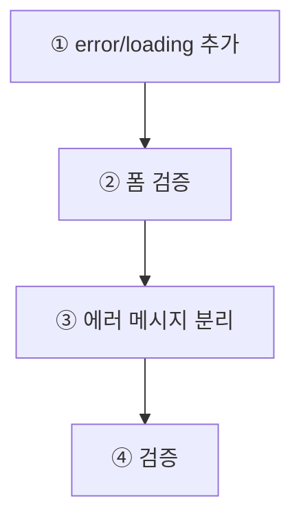

# Chapter 12. 에러 처리와 UX 완성

> **미션**: 로딩, 빈 상태, 에러, 폼 검증을 추가해 사용자가 불편함 없이 쓰는 블로그로 다듬는다

---

## 이 장의 흐름

Ch10 CRUD와 Ch11 RLS 위에 **실패했을 때의 사용자 경험**을 얹는다. 새 기능은 없고, 화면별 실패 케이스를 Copilot에게 정확히 전달한다.



| 단계 | 작업                                    | 절   |
| ---- | --------------------------------------- | ---- |
| ①    | `error.tsx`, `loading.tsx` + 스켈레톤   | 12.2 |
| ②    | 폼 유효성 검증                          | 12.3 |
| ③    | 에러 메시지 유틸 + 로그인/회원가입 적용 | 12.4 |
| ④    | 빌드·배포·브라우저 검증                 | 12.5 |

---

## 학습목표

1. 로딩, 빈 상태, 에러 상태의 차이를 설명할 수 있다
2. App Router의 `error.tsx`, `loading.tsx` 역할을 이해할 수 있다
3. Supabase/RLS 에러를 사용자 친화적 메시지로 바꿀 수 있다
4. 폼 제출 전 최소 유효성 검증을 구현할 수 있다

---

## 12.1 왜 UX 완성인가?

**UI**는 사용자가 보는 것(버튼, 색상, 레이아웃)이고, **UX**는 사용자가 느끼는 것(편한가, 기다릴 수 있는가, 다음에 뭘 해야 하는가)이다. UI가 예뻐도 로딩 중에 흰 화면이 뜨거나 에러 코드가 그대로 노출되면 UX는 나쁘다.

기능이 작동해도 다음 상황이 있으면 사용자는 앱이 망가졌다고 느낀다.

| 상황           | 나쁜 경험      | 필요한 처리          |
| -------------- | -------------- | -------------------- |
| 데이터 로딩 중 | 흰 화면        | 로딩 UI              |
| 게시글 없음    | 빈 화면        | 빈 상태 문구         |
| 권한 없음      | 에러 코드 노출 | 친절한 권한 안내     |
| 저장 실패      | 아무 반응 없음 | 에러 메시지 + 재시도 |
| 폼 누락        | DB 에러        | 입력 전 검증         |

> 개발자에게는 원문 에러가 필요하고, 사용자에게는 해결 가능한 문장이 필요하다. 두 메시지를 섞지 않는다.

---

## 12.2 `error.tsx`, `loading.tsx` 추가 `🤖 바이브코딩`

App Router는 경로 폴더에 `loading.tsx`, `error.tsx`를 두면 해당 구간의 상태 UI를 자동 처리한다. `loading.tsx`는 데이터 도착 전 빈 화면을 막고, `error.tsx`는 렌더링 실패 시 앱이 무너지는 대신 안내 화면을 보여준다.

**1. app/error.tsx** — 앱 전체 에러 안전망

뭔가 터졌을 때 흰 화면 대신 보여주는 화면이다.

- `"use client"` → 버튼 클릭이 필요하므로 클라이언트 컴포넌트
- 사용자에게는 "잠시 후 다시 시도해주세요" 같은 문장만
- 개발자는 브라우저 콘솔에서 실제 에러 확인
- "다시 시도" 버튼 → `reset()` 호출하면 해당 구간을 다시 렌더링 시도

**2. app/loading.tsx** — 앱 전체 로딩 화면

어느 페이지든 데이터 불러오는 동안 보이는 대기 화면이다. 고정 높이를 지정하지 않으면 로딩 끝나고 레이아웃이 갑자기 확 바뀌는 현상이 생긴다.

**3. app/posts/loading.tsx** — 게시글 목록 전용 로딩

목록 페이지에서 카드가 뜨기 전에 카드 모양의 회색 박스 3개를 보여준다. `animate-pulse`는 Tailwind 클래스로, 박스가 깜빡이는 애니메이션을 준다. 사용자가 "곧 뭔가 나오겠구나"를 느낀다.

**4. app/posts/[id]/loading.tsx** — 게시글 상세 전용 로딩

특정 게시글을 여는 동안 제목 자리, 본문 자리에 회색 박스를 배치한다. 실제 내용이 나타날 위치와 같은 구조로 만들어야 로딩 끝나도 화면이 흔들리지 않는다.

**5. app/posts/page.tsx 수정** — 빈 상태 처리

게시글이 0개일 때 아무것도 없으면 사용자는 앱이 고장났다고 생각한다. "아직 게시글이 없습니다" 한 줄만 있어도 "정상 작동 중이고 글이 없는 것"임을 알 수 있다.

### 현실적인 바이브코딩 — 개념으로 시작하기

위 프롬프트는 `error.tsx`, `loading.tsx` 같은 파일 이름을 이미 아는 사람 기준이다. 초보자는 세부 파일명을 모르지만, "에러 처리가 필요하다"는 개념은 안다. 그 개념을 그대로 말하면 된다.

```
내 블로그 앱에 에러 처리와 로딩 UX를 추가하고 싶어.

- 데이터를 불러오는 동안 사용자가 기다릴 수 있게 해줘
- 게시글이 없을 때 빈 화면 대신 안내 문구가 나왔으면 해
- 뭔가 잘못됐을 때 앱이 완전히 멈추지 않고 친절한 안내가 나왔으면 해
- 에러가 났을 때 개발자용 로그는 콘솔에 남기고, 사용자 화면에는 친절한 메시지만 보여줘

Next.js App Router 기준으로, 새 라이브러리 없이 Tailwind CSS만 써줘.
```

---

## 12.3 폼 유효성 검증 `🤖 바이브코딩`

DB 에러가 나기 전에 브라우저에서 먼저 막는다. 이것은 보안 장치가 아니라 사용자 경험 장치이며, 실제 보안은 RLS가 담당한다.

```
게시글 작성 폼(/posts/new)에 클라이언트 유효성 검증을 추가해줘.

요구사항:
- 제목은 필수, 최소 2자
- 내용은 필수, 최소 10자
- 제출 중에는 버튼 비활성화 (중복 제출 방지)
- 실패 시 input 아래에 에러 메시지 표시
- 서버/Supabase 에러 원문은 console.error로 남기고, 화면에는 친절한 메시지만 표시
- 새 라이브러리 추가 금지
```

메시지 예:

| 상황            | 사용자 메시지                             |
| --------------- | ----------------------------------------- |
| 제목 없음       | 제목을 입력해주세요.                      |
| 내용 짧음       | 내용을 10자 이상 입력해주세요.            |
| 권한 없음       | 이 작업을 수행할 권한이 없습니다.         |
| 네트워크 오류   | 인터넷 연결을 확인하고 다시 시도해주세요. |
| 알 수 없는 오류 | 잠시 후 다시 시도해주세요.                |

---

## 12.4 에러 메시지와 로그 분리 `🤖 바이브코딩`

Supabase 에러 코드를 그대로 화면에 보여주지 않는다. 사용자는 `42501`을 봐도 문제를 해결할 수 없으므로 친절한 문장이 필요하고, 개발자는 원인 추적을 위해 콘솔 로그가 필요하다.

```
Supabase/네트워크 에러를 사용자 메시지로 변환하는 유틸 함수를 만들고,
로그인/회원가입 페이지에 적용해줘.

1. lib/error-message.ts 생성
   - 42501 또는 row-level security → "이 작업을 수행할 권한이 없습니다."
   - Failed to fetch → "인터넷 연결을 확인해주세요."
   - not found 계열 → "요청한 게시글을 찾을 수 없습니다."
   - 기본값 → "일시적인 오류가 발생했습니다. 잠시 후 다시 시도해주세요."

2. app/login/page.tsx, app/signup/page.tsx 수정
   - Supabase 에러 원문 대신 위 유틸 함수로 변환한 메시지 표시
   - 개발자용 console.error는 유지
```

---

## 12.5 검증 `⌨️ CLI`

구현이 끝난 뒤 전체를 확인하는 최종 점검 단계다. 세 가지를 순서대로 확인한다.

**1. `npm run build`** — 빌드 오류 점검

코드를 실제 배포 가능한 형태로 변환해보는 것이다. 타입 오류, 문법 오류가 있으면 여기서 걸린다. "로컬에서는 됐는데 배포하니 안 된다"를 미리 막는다.

**2. `git grep`** — 보안 키·구버전 API 검색

실수로 서버 전용 키(`service_role` 등)를 클라이언트 코드에 넣었거나, 쓰면 안 되는 구버전 API(`next/router`, `auth.signIn`)를 쓴 곳이 있는지 파일 전체를 검색한다.

**3. 브라우저 확인** — 실제 화면에서 눈으로 검증

빌드가 통과해도 화면이 의도대로 동작하는지는 직접 봐야 한다. 로딩 스켈레톤이 뜨는지, 빈 상태 문구가 나오는지, 에러 메시지가 친절한지 등을 체크한다.

```bash
npm run build
```

```bash
git grep -nE "service_role|SUPABASE_SERVICE_ROLE|sb_secret_|sbp_" -- 'app/**' 'lib/**' 'components/**' 'contexts/**' 2>/dev/null
git grep -nE "next/router|auth\\.signIn\\(" -- 'app/**' 'lib/**' 'components/**' 'contexts/**' 2>/dev/null
```

### 브라우저 확인

| 시나리오            | 기대 결과                         |
| ------------------- | --------------------------------- |
| `/posts` 로딩 중    | 스켈레톤 또는 로딩 표시           |
| 게시글 0개          | 빈 상태 문구                      |
| 없는 게시글 ID 접속 | not found 안내 화면               |
| 제목 없이 제출      | 제목 입력 안내                    |
| RLS로 저장 실패     | 권한 안내 메시지 (에러 코드 아님) |

---

### 컨텍스트 업데이트

```
Ch12 에러 처리와 UX 개선 작업을 마무리하려고 해.
context.md, todo.md, ARCHITECTURE.md를 업데이트해줘.

반영할 것:
- 추가한 error.tsx/loading.tsx 파일 목록
- 화면별 loading/empty/error 상태
- 폼 검증 규칙
- 에러 메시지 변환 규칙 (lib/error-message.ts)
```
